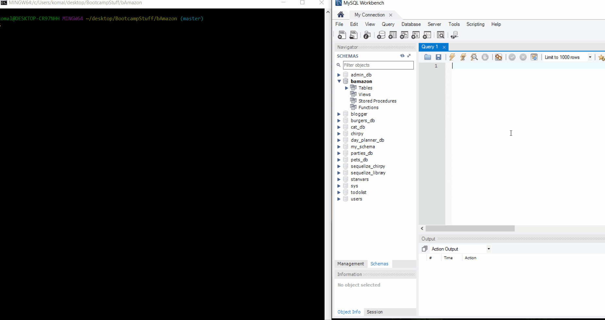
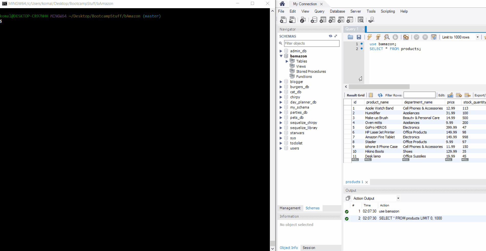
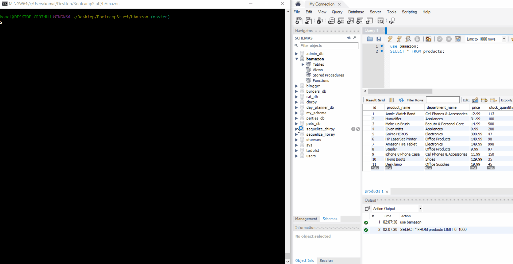

# bamazon-marketplace

## Amazon-like storefront with MySQL database

For this assignment, we were tasked with creating an Amazon-like storefront utilizing MySQL database and table functionality. The app takes in orders from customers and depletes stock from the store's inventory. 

## Customer View & Features

Upon starting the app, cusomters are greeted with a welcome message and shown the list of items for sale in the database. This information is queried from a MySQL server I'm running off of my laptop. The user is prompted to enter a matching ItemID of a product they're interested and then subsequently prompted for a desired quantity. If you look to the right, you'll see that once the order has completed, the MySQL table is updated to reflect that. In this case, the customer's purchase of 4 keyboards reduced our stock to 15. 

Should a user request a larger quantity than is available, they'll be informed of such and sent back to the marketplace to choose another item or request a smaller quantity to order.

## Manager View & Features

Upon starting the app, users will be presented with a welcome message to Manager's Page and a list of options to choose from. Their first option, "View Products for Sale" allows them to view all items listed for sale and their available stock - inormation that was hidden from the user accessing the same table through the Customer app.
When you choose "View Products for Sale", they'll be presented with all products in the database 

When you choose "View Low Inventory", they'll be presented with all products in the database with 50 or less available units for purchase.

If you wish to add items to the inventory, the manager may do so through the "Add to Inventory" option. Here they'll be presented with the marketplace listing and asked to input an itemID from those listed. Then they'll be prompted to enter the desired quantity they'd like to order for restocking.

The fourth option, "Add New Product", will prompt the user to enter a unique Item ID, a product name, a department name, a price, and the starting quantity. Once all answers have been submitted, they'll be added to the table. Here the user is adding a Computer Mouse to the database table. See below for both the manager's addition of the new product - 

- and the customer seeing the same on their next login.

## Final Notes

This app is powered by the MySQL, Inquirer, Node.js and JavaScript. 